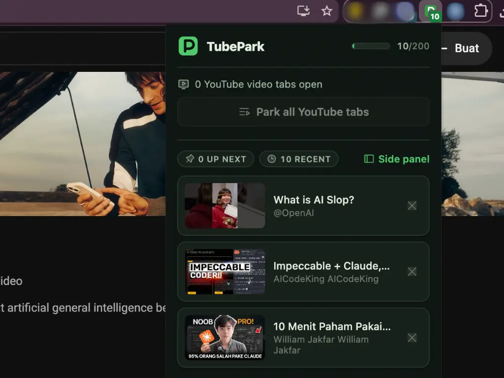
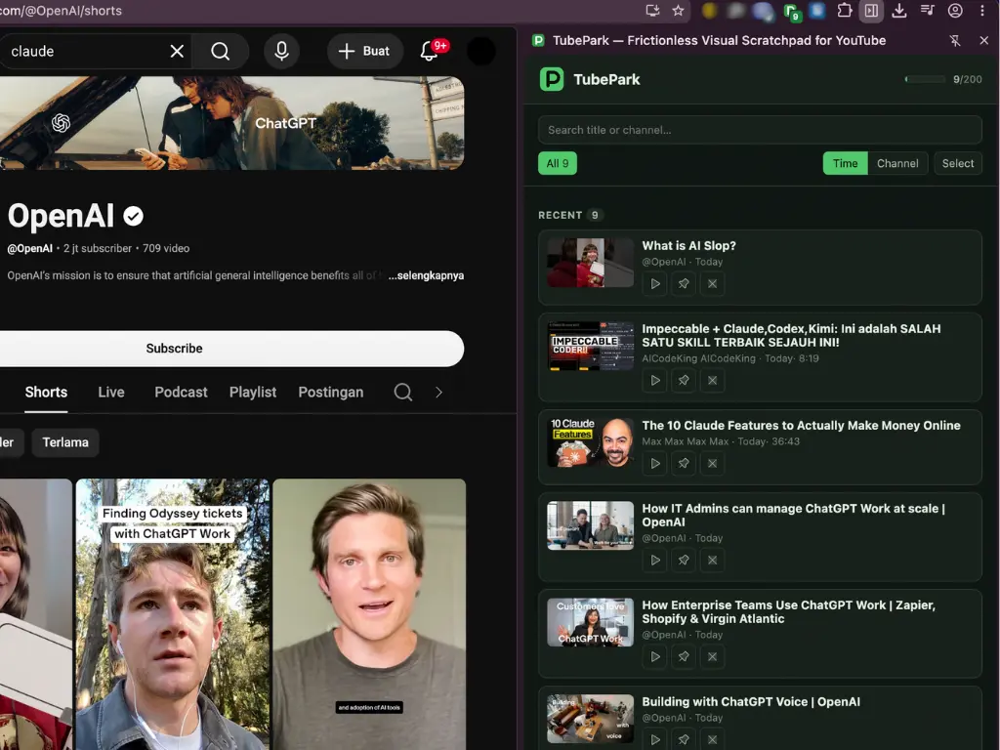

<div align="center">
  

  # TubePark

  **A frictionless visual scratchpad for YouTube.**

  Turn a horizontal tab-bar mess into a vertical, thumbnail-rich queue — one hover, one click, parked.

  <sub>Manifest V3 browser extension · Built with [WXT](https://wxt.dev) + [Svelte 5](https://svelte.dev)</sub>
</div>

---

When you're deep in a YouTube hunt, the tab bar fills up fast. Past ~20 tabs the titles truncate, the favicons blur together, and you lose the one thing that mattered: knowing what each tab actually contains. TubePark calls this **Visual Context Loss** — and treats it as the real enemy, not RAM.

Instead of a wall of identical tabs, TubePark gives you a clean vertical queue where every parked video keeps its thumbnail, title, and channel. Park what you want to watch later, close the tab, and come back to a contextual to-watch list whenever you're ready.

> [!NOTE]
> TubePark is a **queue**, not a history log. Videos live in the queue until you explicitly remove them (individually, or in bulk once they've aged past 7 days in the Side Panel's *Lebih Lama* group). There's deliberately no "watched" archive — YouTube's native History already does that.

## Features

- **Hover-to-park** — hover any video card on YouTube and a floating park button appears over the thumbnail. One click, it's queued.
- **Context-menu capture** — right-click any YouTube watch link → *Park This Video*. Scoped so it only shows on real video links, never on blank space.
- **Park the current tab** — from the popup, park the video you're watching and close its tab in one action.
- **Park all** — sweep every open YouTube tab into the queue at once.
- **Thumbnail-rich queue** — every item shows its thumbnail, title, and channel. Thumbnails resolve live from YouTube (never stored), with an elegant placeholder when a video is offline or private.
- **Two surfaces, two jobs** — a fast-action **Popup** for quick parking, and a persistent **Side Panel** workspace for reviewing and triaging your queue across tab switches.
- **Time-grouped review** — the side panel sorts items into *Up Next* (pinned), *Baru* (recent), and *Lebih Lama* (older), so the queue stays scannable.
- **One-in-one-out playback** — playing a queued video reuses your existing YouTube tab instead of piling on new ones.
- **Capacity guardrails** — a 200-item cap with a *safe → warning → full* meter that nudges you to curate before the queue becomes its own kind of clutter.
- **Light & dark themes** — a "taman" (garden) palette that follows your system: *taman siang* by day, *taman malam* by night.

## Screenshots

<div align="center">
  <table>
    <tr>
      <td align="center"></td>
      <td align="center"></td>
    </tr>
    <tr>
      <th>Popup</th>
      <th>Side Panel</th>
    </tr>
  </table>
</div>

The **Popup** is the fast-action surface — park the current tab, park all tabs, glance at recent items. The **Side Panel** is the persistent review workspace — grouped queue, pin, play, and remove.

## Getting started

### Install from a release

The quickest way to try TubePark — no toolchain required.

1. Download `tubepark-<version>-chrome.zip` from the [latest release](https://github.com/ramaaudra/tubepark/releases/latest).
2. Unzip it to a folder you'll keep (the browser loads the extension from this folder).
3. Open `chrome://extensions` and enable **Developer mode** (top-right toggle).
4. Click **Load unpacked** and select the unzipped folder.
5. Pin TubePark from the toolbar puzzle-piece menu, then open YouTube.

> [!NOTE]
> TubePark isn't on the Chrome Web Store yet, so it loads as an unpacked extension. Keep the unzipped folder around — deleting it removes the extension.

### Build from source

For development, or to build the package yourself.

**Prerequisites**

- [Node.js](https://nodejs.org) 20 or newer
- A Chromium-based browser (Chrome, Edge, Brave, …)

```bash
git clone https://github.com/ramaaudra/tubepark.git
cd tubepark
npm install
npm run dev
```

WXT launches a browser with the extension auto-loaded and hot-reloading enabled. Edit a file and the extension refreshes itself.

> [!TIP]
> To load a production build into your everyday browser instead, run `npm run build`, then open `chrome://extensions`, enable **Developer mode**, and choose **Load unpacked** → `.output/chrome-mv3`.

### Use it

1. Open [YouTube](https://youtube.com) and hover any video card — the park button appears over the thumbnail.
2. Click the toolbar icon for the **Popup**, or open the **Side Panel** for the full queue.
3. Park, review, play, remove.

## Build & package

```bash
npm run build      # production build → .output/chrome-mv3
npm run zip        # zipped, store-ready package
```

## How it works

TubePark is a small Manifest V3 extension with four moving parts:

| Part | Responsibility |
| --- | --- |
| **Content script** | Injects the floating park button into YouTube and reads video metadata from cards. |
| **Background service worker** | Registers the context menu and persists park requests to storage. |
| **Popup** | Fast-action surface: park the current tab, park all tabs, glance at recent items. |
| **Side Panel** | Persistent review workspace: grouped queue, pin, play, remove. |

The queue lives in `chrome.storage.local` under `tubepark_queue`. A parked video is a minimal record — `id`, `title`, `channel`, `addedAt` — kept intentionally lightweight.

> [!IMPORTANT]
> Capturing metadata from YouTube is the hard part, because YouTube churns its DOM constantly. TubePark stays resilient by treating one invariant as the source of truth: *a video card always contains an `<a>` to `/watch?v=…`*. Id-based lookups are only a fast path; the anchor href is the fallback that survives redesigns.

### Design decisions

Key architectural choices are recorded as ADRs in [`docs/adr/`](docs/adr):

- [0001](docs/adr/0001-context-menu-scoping.md) — scoping the context menu to YouTube watch links only.
- [0002](docs/adr/0002-expiry-alarms.md) — planned auto-expire design via `chrome.alarms`; superseded, never implemented (queue trimming is manual only in the shipped MVP).
- [0003](docs/adr/0003-thumbnails-dynamic.md) — resolving thumbnails dynamically instead of storing them.
- [0004](docs/adr/0004-migrate-to-wxt.md) — adopting WXT as the build system.

The full domain model and ubiquitous language live in [`CONTEXT.md`](CONTEXT.md).

All `chrome.tabs` / `chrome.windows` / `chrome.sidePanel` calls are routed through a single **TabOperations** seam ([`src/shared/tab-operations.ts`](src/shared/tab-operations.ts)) with a real adapter for production and a recording test double — so behavior can be verified without a live browser.

## Testing

The capture, storage, grouping, motion, and tab-operations logic is covered by [Vitest](https://vitest.dev), with real-world YouTube DOM fixtures parsed via [linkedom](https://github.com/WebReflection/linkedom).

```bash
npm test           # run the suite once
npm run typecheck  # type-check without emitting
```

## Project structure

```
src/
  entrypoints/
    background.ts        # service worker: context menu + park requests
    content.ts           # floating park button injected into YouTube
    popup/               # fast-action popup (Svelte)
    sidepanel/           # persistent review workspace (Svelte)
  components/            # shared Svelte UI (Thumbnail, Icon, ParkMeter, …)
  shared/
    capture-predicates.ts  # YouTube DOM → video metadata
    storage.ts             # queue persistence + pure reducers
    grouping.ts            # time-based grouping & age badges
    tab-operations.ts      # chrome.* seam (real + test adapters)
    types.ts               # ParkedVideo, capacity model
    tokens.css             # design tokens (light/dark)
docs/adr/                # architecture decision records
public/icon/             # extension icons
```

## Tech stack

- **[WXT](https://wxt.dev)** — next-gen web extension framework (Manifest V3).
- **[Svelte 5](https://svelte.dev)** — reactive UI for the popup and side panel.
- **[TypeScript](https://www.typescriptlang.org)** — end to end.
- **[Vitest](https://vitest.dev)** + **[linkedom](https://github.com/WebReflection/linkedom)** — fast unit tests against real DOM fixtures.

## Privacy

TubePark stores your queue entirely on your own device (`chrome.storage.local`) — no servers, no accounts, no analytics, no tracking. See the full [Privacy Policy](PRIVACY.md).
